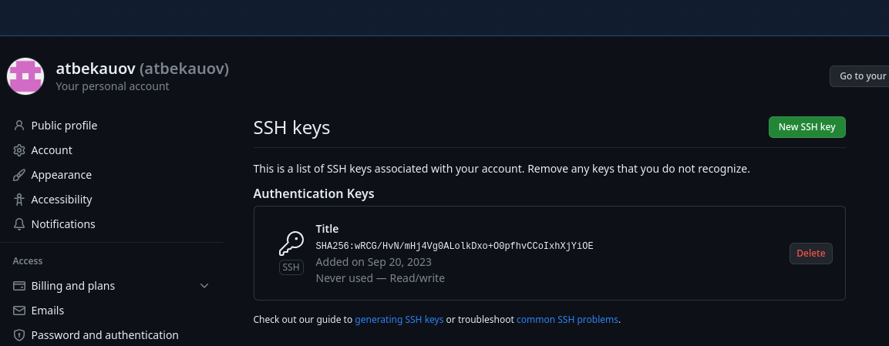
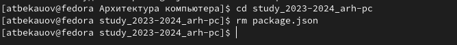
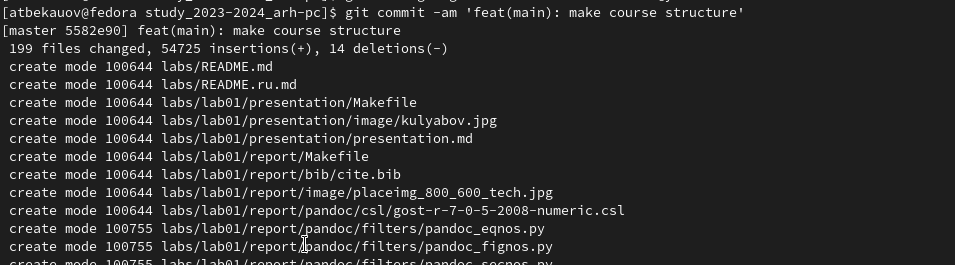

---
## Front matter
title: "Отчет по Лаборатоорной работе №2"
subtitle: "Архитектура компьютеров и операционные системы"
author: "Бекауов Артур Тимурович"

## Generic otions
lang: ru-RU
toc-title: "Содержание"

## Bibliography
bibliography: bib/cite.bib
csl: pandoc/csl/gost-r-7-0-5-2008-numeric.csl

## Pdf output format
toc: true # Table of contents
toc-depth: 2
lof: true # List of figures
lot: true # List of tables
fontsize: 12pt
linestretch: 1.5
papersize: a4
documentclass: scrreprt
## I18n polyglossia
polyglossia-lang:
  name: russian
  options:
	- spelling=modern
	- babelshorthands=true
polyglossia-otherlangs:
  name: english
## I18n babel
babel-lang: russian
babel-otherlangs: english
## Fonts
mainfont: PT Serif
romanfont: PT Serif
sansfont: PT Sans
monofont: PT Mono
mainfontoptions: Ligatures=TeX
romanfontoptions: Ligatures=TeX
sansfontoptions: Ligatures=TeX,Scale=MatchLowercase
monofontoptions: Scale=MatchLowercase,Scale=0.9
## Biblatex
biblatex: true
biblio-style: "gost-numeric"
biblatexoptions:
  - parentracker=true
  - backend=biber
  - hyperref=auto
  - language=auto
  - autolang=other*
  - citestyle=gost-numeric
## Pandoc-crossref LaTeX customization
figureTitle: "Рис."
tableTitle: "Таблица"
listingTitle: "Листинг"
lofTitle: "Список иллюстраций"
lotTitle: "Список таблиц"
lolTitle: "Листинги"
## Misc options
indent: true
header-includes:
  - \usepackage{indentfirst}
  - \usepackage{float} # keep figures where there are in the text
  - \floatplacement{figure}{H} # keep figures where there are in the text
---

# Цель работы

Целью данной работы является изучить идеологию и применение средств контроля версий. Приобрети практические навыки по работе с системой git.

# Ход лабораторной работы

**А. Настройка github**

Захожу на сайт https://github.com/ и создаю на нём учетную запись, заполняю основные данные. 

**B. Базовая настройка git**

Затем открываю терминал и произвожу предварительную конфигурацию git, указав имя и email владельца репозитория. Также настраиваю utf-8 в выводе сообщений git (рис. @fig:1).

{#fig:1}

Далее задаю имя начальной ветки (master), настраиваю параметры autocrlf и safecrlf (рис. @fig:2).

{#fig:2}

**С. Создание SSH ключа.**

 После этого генерирую пару ключей, они сохранятся в каталоге ~/.ssh/. и понадобятся для последующей идентификации пользователя на сервере (рис. @fig:3). 

{#fig:3}

Загружу сгенерённый ключ. Для этого копирую ключ из локальной консоли в буфер обмена (рис. @fig:4). Затем захожу на сайт https://github.org/ под своей учётной записью и во вкладке настройки, выбираю “SSH и GPG ключи”, далле - “Новый SSH ключ”. В поле “Имя ключа” указываю “Title”, а в поле “Ключ” вставляю скопированный ключ (рис. @fig:5). Удостоверимся, что Ключ появился в github (рис. @fig:6). 

{#fig:4}

{#fig:5}

{#fig:6}

**D. Создание рабочего пространства.**

Затем я открыл терминал и создал каталог для предмета “Архитектура компьютера”, придерживаясь структуры рабочего пространства, т.е чтобы оно удовлетворяло следующей иерархии: ~/work/study/<учебный год>/<Название предмета>. (Рис. @fig:7).

{#fig:7}

**Е. Создание репозитория курса на основе шаблона.**

Далее перехожу на страницу репозитория с шаблоном курса https://github.com/yamadharma/course-directory-student-template. Выбираю “Выбрать этот шаблон”, из падующего списка нажимаю на “Создать новый репозиторий”, указываю имя (study_2023-2024_arh-pc) и создаю репозиторий (рис. @fig:8).

{#fig:8}

Затем открываю терминал, перехожу в каталог курса и клонирую туда созданный репозиторий. Затем сразу проверю успешность операции с помощью команды ls. (рис. @fig:9)

{#fig:9}

**F. Настройка каталога курса**

Перехожу в каталог курса и удаляю лишние файлы (рис. @fig:10). Также создам необходимые каталоги (рис. @fig:11) и отправлю файлы на сервер (рис. @fig:12, @fig:13, @fig:14). Затем проверю правильность создания иерархии рабочего стола в локальном репозитории (рис. @fig:15, @fig:16) и на странице github (рис. @fig:17).

{#fig:10}

{#fig:11}

{#fig:12}

{#fig:13}

{#fig:14}

{#fig:15}

{#fig:16}

{#fig:17}

# Ход самостоятельной работы

Создаю в локальном репозитории файл отчета 2-ой лабораторной работы в соответствующей папке, также копирую отчет первой лабораторной работы в папку, предназначенную для него. (Рис. @fig:18)

{#fig:18}

Далее загружаю файлы на github (рис. @fig:19). Наконец проверяю наличие файлов на github (рис. @fig:20).

{#fig:19}

{#fig:20}

# Выводы

При выполнении лабораторной работы я изучил идеологию и применение средств контроля версий. Также я приобрёл практические навыки по работе с системой git.

