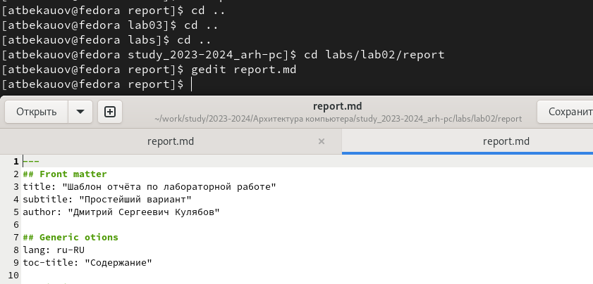

---
## Front matter
title: "Отчет по Лаборатоорной работе №3"
subtitle: "Архитектура компьютеров и операционные системы"
author: "Бекауов Артур Тимурович"

## Generic otions
lang: ru-RU
toc-title: "Содержание"

## Bibliography
bibliography: bib/cite.bib
csl: pandoc/csl/gost-r-7-0-5-2008-numeric.csl

## Pdf output format
toc: true # Table of contents
toc-depth: 2
lof: true # List of figures
lot: true # List of tables
fontsize: 12pt
linestretch: 1.5
papersize: a4
documentclass: scrreprt
## I18n polyglossia
polyglossia-lang:
  name: russian
  options:
	- spelling=modern
	- babelshorthands=true
polyglossia-otherlangs:
  name: english
## I18n babel
babel-lang: russian
babel-otherlangs: english
## Fonts
mainfont: PT Serif
romanfont: PT Serif
sansfont: PT Sans
monofont: PT Mono
mainfontoptions: Ligatures=TeX
romanfontoptions: Ligatures=TeX
sansfontoptions: Ligatures=TeX,Scale=MatchLowercase
monofontoptions: Scale=MatchLowercase,Scale=0.9
## Biblatex
biblatex: true
biblio-style: "gost-numeric"
biblatexoptions:
  - parentracker=true
  - backend=biber
  - hyperref=auto
  - language=auto
  - autolang=other*
  - citestyle=gost-numeric
## Pandoc-crossref LaTeX customization
figureTitle: "Рис."
tableTitle: "Таблица"
listingTitle: "Листинг"
lofTitle: "Список иллюстраций"
lotTitle: "Список таблиц"
lolTitle: "Листинги"
## Misc options
indent: true
header-includes:
  - \usepackage{indentfirst}
  - \usepackage{float} # keep figures where there are in the text
  - \floatplacement{figure}{H} # keep figures where there are in the text
---

# Цель работы

Целью работы является освоение процедуры оформления отчетов с помощью легковесного
языка разметки Markdown.

# Ход лабораторной работы

Сначала открываю терминал и перехожу в каталог курса, сформированный при выполнении лабораторной работы №2. Затем ввожу команду git pull, чтобы обновить локальный репохиторий, скачав изменения из удаленного репозитория. На моём устройстве уже установлена актуальная версия репозитория, потому получаю соответствующий вывод (Рис. @fig:1).

{#fig:1}

Далее перехожу в каталог с шаблоном отчета по Лабораторной работе №3 и провожу компиляцию шаблона с использованием Makefile. После проверки выяснилось, что были сгенерированы файлы report.pdf и report.dox (Рис. @fig:2).

{#fig:2}

Затем удаляю созданные раннее файлы всё так же с использованием Makefile. Проверю, что удаление прошло успешно (Рис. @fig:3).

{#fig:3}

Открываю файл report.md с помощью текстового редактора gedit (Риc. @fig:4).

{#fig:4}

Используя открытый файл как шаблон, создам отчёт по 3-ей лабораторной работе в формате Markdown (Рис. @fig:5). 

{#fig:5}

С помощью команды make создам отчёты в формате pdf и docx, и загружу все файлы на github (Рис. @fig:6). 

{#fig:6}

# Ход самостоятельной работы

Открываю каталог для отчета по Лабораторной работе №2, через текстовый редактор gedit открываю файл report.md. Оформляю отчёт по ЛО2 в формате Markdown (рис. @fig:7).

{#fig:7}

С помощью команды make создаю отчеты в формате pdf и docx (Рис. @fig:8)

{#fig:8}

Затем загружаю все сделанные изменения на github (Рис. @fig:9)

{#fig:9}

# Выводы

В ходе лабораторной работы я освоил процедуры оформления отчетов с помощью легковесного языка разметки Markdown.

