---
## Front matter
title: "Отчет по Лабораторной работе №4"
subtitle: "Архитектура компьютеров и операционные системы"
author: "Бекауов Артур Тимурович НКАбд-01-23"

## Generic otions
lang: ru-RU
toc-title: "Содержание"

## Bibliography
bibliography: bib/cite.bib
csl: pandoc/csl/gost-r-7-0-5-2008-numeric.csl

## Pdf output format
toc: true # Table of contents
toc-depth: 2
lof: true # List of figures
lot: true # List of tables
fontsize: 14pt
linestretch: 1.5
papersize: a4
documentclass: scrreprt
## I18n polyglossia
polyglossia-lang:
  name: russian
  options:
	- spelling=modern
	- babelshorthands=true
polyglossia-otherlangs:
  name: english
## I18n babel
babel-lang: russian
babel-otherlangs: english
## Fonts
mainfont: PT Serif
romanfont: PT Serif
sansfont: PT Sans
monofont: PT Mono
mainfontoptions: Ligatures=TeX
romanfontoptions: Ligatures=TeX
sansfontoptions: Ligatures=TeX,Scale=MatchLowercase
monofontoptions: Scale=MatchLowercase,Scale=0.9
## Biblatex
biblatex: true
biblio-style: "gost-numeric"
biblatexoptions:
  - parentracker=true
  - backend=biber
  - hyperref=auto
  - language=auto
  - autolang=other*
  - citestyle=gost-numeric
## Pandoc-crossref LaTeX customization
figureTitle: "Рис."
tableTitle: "Таблица"
listingTitle: "Листинг"
lofTitle: "Список иллюстраций"
lotTitle: "Список таблиц"
lolTitle: "Листинги"
## Misc options
indent: true
header-includes:
  - \usepackage{indentfirst}
  - \usepackage{float} # keep figures where there are in the text
  - \floatplacement{figure}{H} # keep figures where there are in the text
---

# Цель работы

Целью работы является освоение процедуры компиляции и сборки программ, написанных на ассемблере NASM

# Ход лабораторной работы

**A. Программа Hello world!**

Сначала открываю терминал и создаю в каталоге курса папку для работы с программами на языке ассембелра NASM, перехожу в созданный каталог и создаю текстовый файл с именем "hello.asm". Открываю созданный файл с помощью gedit (Рис. @fig:1) ввожу в него предложенный текст программы (Рис. @fig:2)

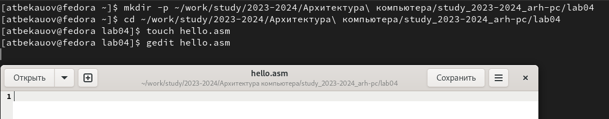{#fig:1}

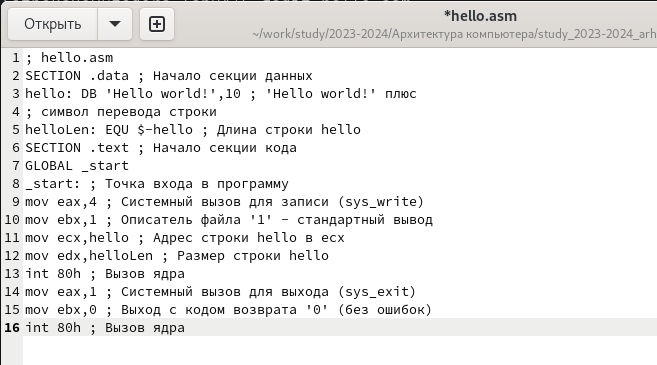{#fig:2}

**B. Транслятор NASM**

Затем превращу текст программы в объектный код. Проверю содержимое папки комндой ls, вижу, что из текстового файла "hello.asm" был создан объектный файл "hello.o" (Рис. @fig:3). 

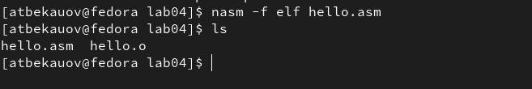{#fig:3}

**C. Расширенный синтаксис командной строки NASM**

Далле ввожу команду "nas, -o obj.o -f elf -g -l list.lst hello.asm". Проверю результаты её выполнения с помощью ls. Итак, команда создала из текстового файла "hello.asm" объектный файл, названный "obj.o" (-o obj.o) с форматом elf (-f elf), в который будут также включены символы для отладки (-g). Помимо этого был создан файл листинга list.lst (-l list.lst)  (Риc. @fig:4).

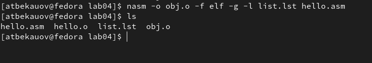{#fig:4}

**D. Компоновщик LD**
 
Передам объектый файл "hello.o" на обработку компоновщику, чтобы получить исполняемую программу "hello". Проверю результаты работы компоновщика с помощью ls. (Рис. @fig:5). 

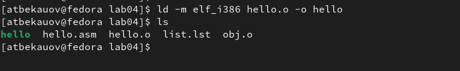{#fig:5}

Далее выполню следующую команду "ld -m elf_i386 obj.o -o main", которая создаст исполняемый файл "main" (-o main) из объектного файла "obj.o". Проверю с помощью ls (Рис. @fig:6). 

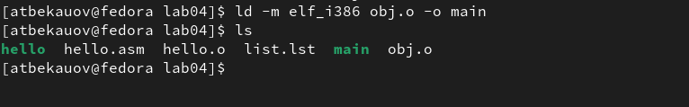{#fig:6}

**E. Запуск исполняемого файла**

Запущу на исполнение созданный исполняемый файл. В результате на экран выведено сообщение "Hello world!" (Рис. @fig:7).

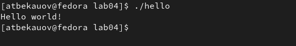{#fig:7}

# Ход самостоятельной работы

**1**

Командой ls покажу изначальное содержание папки. С помощью команды "cp" создам копию файла "hello.asm" с именем "lab4.asm". Продемонстрирую результаты копирования командой ls (Рис. @fig:8)

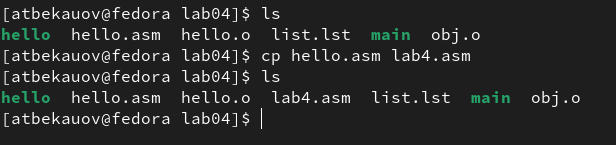{#fig:8}

**2**

Открою "lab4.asm" в gedit. Изменю текст программы так, чтобы программа выводила моё имя и фамилию. (Рис. @fig:9)

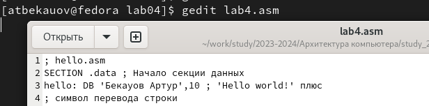{#fig:9}

**3**

Текстовую программу "lab4.asm" с помощью NASM переведу в объектный код, который передам на обработку компановщику LD. На выходе получил исполняемую программу lab4, которую запущу через терминал. Программа вывела на экран моё имя и фамилию (Рис @fig:10)

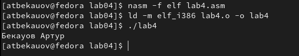{#fig:10}

**4**

Скопирую файлы "hello.asm" и "lab4.asm" в свой локальный репозиторий папку для лабораторной работы №4 (Рис. @fig:11)
Затем загружаю все сделанные изменения на github (Рис. @fig:11).

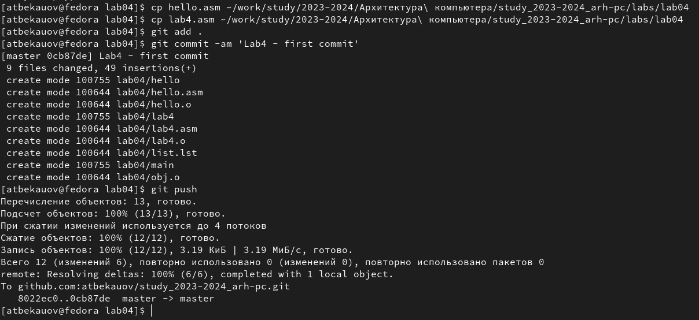{#fig:11}

# Выводы

В ходе лабораторной работы я освоил процедуры компиляции и сборки программ, написанных на ассемблере NASM.
