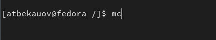

---
## Front matter
title: "Отчет по Лабораторной работе №5"
subtitle: "Архитектура компьютеров и операционные системы"
author: "Бекауов Артур Тимурович НКАбд-01-23"

## Generic otions
lang: ru-RU
toc-title: "Содержание"

## Bibliography
bibliography: bib/cite.bib
csl: pandoc/csl/gost-r-7-0-5-2008-numeric.csl

## Pdf output format
toc: true # Table of contents
toc-depth: 2
lof: true # List of figures
lot: true # List of tables
fontsize: 14pt
linestretch: 1.5
papersize: a4
documentclass: scrreprt
## I18n polyglossia
polyglossia-lang:
  name: russian
  options:
	- spelling=modern
	- babelshorthands=true
polyglossia-otherlangs:
  name: english
## I18n babel
babel-lang: russian
babel-otherlangs: english
## Fonts
mainfont: PT Serif
romanfont: PT Serif
sansfont: PT Sans
monofont: PT Mono
mainfontoptions: Ligatures=TeX
romanfontoptions: Ligatures=TeX
sansfontoptions: Ligatures=TeX,Scale=MatchLowercase
monofontoptions: Scale=MatchLowercase,Scale=0.9
## Biblatex
biblatex: true
biblio-style: "gost-numeric"
biblatexoptions:
  - parentracker=true
  - backend=biber
  - hyperref=auto
  - language=auto
  - autolang=other*
  - citestyle=gost-numeric
## Pandoc-crossref LaTeX customization
figureTitle: "Рис."
tableTitle: "Таблица"
listingTitle: "Листинг"
lofTitle: "Список иллюстраций"
lotTitle: "Список таблиц"
lolTitle: "Листинги"
## Misc options
indent: true
header-includes:
  - \usepackage{indentfirst}
  - \usepackage{float} # keep figures where there are in the text
  - \floatplacement{figure}{H} # keep figures where there are in the text
---

# Цель работы

Целью работы является приобретение практических навыков работы в Midnight Commander. Также освоение инструкций языка ассемблера mov и int.

# Ход лабораторной работы

Открываю терминал и ввожу команду для вызова файлового менеджера Midnight Commander(mc) (Рис. @fig:1 и @fig:2). Перехожу в каталог work/arch-pc созданный при выполнении ЛР№4 и создаю в нём папку "lab05" (Рис. @fig:3). С помощью команды touch создаю в этой папке текстовый файл "lab5-1.asm" (Рис. @fig:4). Пользуясь функциональной клавишей f4, открываю "lab5-1.asm" для редактирования в встроенном редакторе mcedit. Ввожу текст предложенного в методичке листинга 5.1, сохраняю изменения и закрываю файл. (Рис. @fig:5). Оставил комментарии в программе для удобства редактирования.

{#fig:1}

{#fig:2}

{#fig:3}

{#fig:4}

{#fig:5}

Удостоверюсь, что файл "lab5-1.asm" содержит текст программы, открыв его для просмотра функциональной клавишей f3 (Рис. @fig:6). Оттранслирую текст программы в объектный файл (с помощью команды nasm), затем выполню компановку объектного файла (с помощью команды ld) и запущу получившийся исполняемый файл. Программа вывела строку "Введите строку:" и ожилает ввода с клавиатуры. Ввожу свои ФИО. (Рис. @fig:7)

{#fig:6}

{#fig:7}

**Подключение внешнего файла in_out.asm**

Скачаю со страницы курса в ТУИС файл "in_out.asm". Подключаемый файл должен лежать в том же каталоге, что и файл с программой, в которой он используется. Поэтому копирую файл "in_out.asm" из папки загрузки домашнего католога, в папку с "lab5-1.asm" (С помощью MC и функциональной клавиши f5) (Рис. @fig:8). 

{#fig:8}

Скопирую файл "lab5-1.asm" с новым именем "lab5-2" (Рис. @fig:9). Открою созданный в результате копирования файл в редакторе mcedit. Отередактирую содержимое файла в соответствии с листингом 5.2, что позволит мне исползовать подпрограммы из внешнего файла (Рис. @fig:10). Создам исполняемый файл и проверю его работу. (Рис. @fig:11).

{#fig:9}

{#fig:10}

{#fig:11}

Заменю в файле "lab5-2.asm" подпрограмму sprintLF на sprint.(Рис. @fig:12) Создам исполняемый файл и проверю его работу (Рис. @fig:13). Как видно разница заключается в том, что подпрограмма sprintLF сначала совершает переход на новую строчку, а затем запрашивает ввод с клавиатуры. Подпрограмма sprint же совершает запрос на ввод с клавиатуры без перехода на новую строчку.

{#fig:12}

{#fig:13}

# Ход самостоятельной работы

Создам копию файла "lab5-1.asm" с названием "lab5-1-2.asm". Внесу в программу изменения, так чтобы она выводила внесённую с клавиатуры строку на экран. А именно: после системного вызова 'read', перед 'exit' добавлю ещё один вызов 'write', выглядящий следующим образом (Рис. @fig:14). Сохраню изменения и закрою файл.

{#fig:14}

Также создам копию файла "lab5-2.asm" с названием "lab5-2-2.asm". Внесу в программу изменения, так чтобы она выводила внесённую с клавиатуры строку на экран, но при этом использовала подпрограммы из внешнего файла. А именно:  После вызова подпрограммы для ввода сообщения добавлю две строчки - адрес выводимого сообщения в EAX и вызов подпрграммы для вывода сообщения (Рис. @fig:15). Сохраню изменения и закрою файл.

{#fig:15}

Создам исполняемые файлы "lab5-1-2" и "lab5-2-2" и проверю их работу (Рис. @fig:16). В качестве ввода с клавиатуры использовал свою фамилию. Как видно программы написаны верно.

{#fig:16}

# Выводы

В ходе лабораторной работы я приобрёл практические навыки работы в Midnight Commander. Также освоил инструкции языка ассемблера mov и int.
