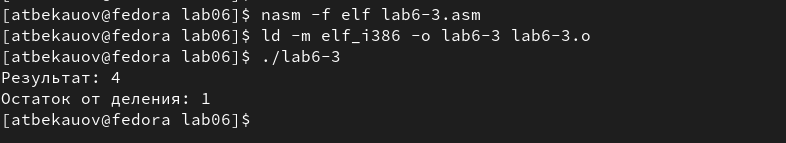

---
## Front matter
title: "Отчет по Лабораторной работе №6"
subtitle: "Архитектура компьютеров и операционные системы"
author: "Бекауов Артур Тимурович НКАбд-01-23"

## Generic otions
lang: ru-RU
toc-title: "Содержание"

## Bibliography
bibliography: bib/cite.bib
csl: pandoc/csl/gost-r-7-0-5-2008-numeric.csl

## Pdf output format
toc: true # Table of contents
toc-depth: 2
lof: true # List of figures
lot: true # List of tables
fontsize: 14pt
linestretch: 1.5
papersize: a4
documentclass: scrreprt
## I18n polyglossia
polyglossia-lang:
  name: russian
  options:
	- spelling=modern
	- babelshorthands=true
polyglossia-otherlangs:
  name: english
## I18n babel
babel-lang: russian
babel-otherlangs: english
## Fonts
mainfont: PT Serif
romanfont: PT Serif
sansfont: PT Sans
monofont: PT Mono
mainfontoptions: Ligatures=TeX
romanfontoptions: Ligatures=TeX
sansfontoptions: Ligatures=TeX,Scale=MatchLowercase
monofontoptions: Scale=MatchLowercase,Scale=0.9
## Biblatex
biblatex: true
biblio-style: "gost-numeric"
biblatexoptions:
  - parentracker=true
  - backend=biber
  - hyperref=auto
  - language=auto
  - autolang=other*
  - citestyle=gost-numeric
## Pandoc-crossref LaTeX customization
figureTitle: "Рис."
tableTitle: "Таблица"
listingTitle: "Листинг"
lofTitle: "Список иллюстраций"
lotTitle: "Список таблиц"
lolTitle: "Листинги"
## Misc options
indent: true
header-includes:
  - \usepackage{indentfirst}
  - \usepackage{float} # keep figures where there are in the text
  - \floatplacement{figure}{H} # keep figures where there are in the text
---

# Цель работы

Целью работы является освоение арифметических инструкций языка ассемблера NASM.

# Ход лабораторной работы

**Символьные и численные данные в NASM**

Создаю каталог для программ ЛО№6, перехожу в него cкопирую из папки для ЛО№5 файл “in_out.asm” и создаю текстовый файл "lab6-1.asm" (Рис. @fig:1). Открываю файл в mcedit, и ввожу в него текст листинга 6.1 (Рис. @fig:2)

{#fig:1}

{#fig:2}

Создаю исполняемый файл "lab6-1" и запускаю его (Рис. @fig:3) 

{#fig:3}

В качестве ответа, вопреки ожиданиям, на экране появилась буква j, а не число 10. Это происходит потому, что  программа посчитала сумму кодов символов 4 и 6 в двоичном представлении и вывела символ j, код которого соответствует этой сумме.

Далее изменю текст программы и вместо символов запишу в регистры числа (Рис. @fig:4). 

{#fig:4}

Создаю опять исполняемый файл “lab6-1” и запускаю его (Рис. @fig:5)

{#fig:5}

Как видно, число 10 опять не было выведено на экран. Вместо этого выведен символ с кодом 10, пользуясь таблицей ASCII, вижу что десятичному коду 10 соответствует “line feed” - символ переносящий на новую строку (Рис. @fig:6). Символ как таковой не видно, но его последствия мы видим - на месте вывода пустая строка.

{#fig:6}

Создаю файл “lab6-2.asm” в папке ЛО№6, открываю его в mcedit, и ввожу в него текст листинга 6.2 (Рис. @fig:7). 

{#fig:7}

Создам исполняемый файл “lab6-2” и запущу его (Рис. @fig:8)

{#fig:8}

В результате работы программы мы получили число 106. В данном случае, как и в первом, команда add складывает коды символов ‘6’ и ‘4’ (54+52=106). Однако, в отличии от программы "lab6-1", функция iprintLF позволяет вывести число, а не символ, кодом которого является это число.

Аналогично предыдущей программе, изменим в тексте программы "lab6-2.asm" символы на числа (Рис. @fig:9)

{#fig:9}

Создаю опять исполняемый файл “lab6-2” и запускаю его (Рис. @fig:10)

{#fig:10}

В этот раз всё получилось, как я и хотел и вывелось 10 - сумма чисел 4 и 6. Заменю функцию iprintLF на iprint в тексте программы "lab6-2.asm" (Рис. @fig:11) и сравню получившиеся результаты программ "lab6-2.asm" (Рис. @fig:12)

{#fig:11} 

{#fig:12}

Как можно увидеть, разница в выводе двух программ заключается в том, что после команды iprintLF совершается переход на новую строчку, а во-втором случае - после iprint переход не совершается, из-за чего вывод программы "lab6-2.asm" оказался на одной строчке с вызовом новой команды терминалом.

**Выполнение арифметических операций в NASM**

В качестве примера выполнения арифметических действий создам программу вычисления арифметического выражения f(x)=(5*2+3)/3. Для этого создаю файл “lab6-3.asm” в папке ЛО№6, открываю его в mcedit, и ввожу в него текст листинга 6.3 (Рис. @fig:13).

{#fig:13}

Создам исполняемый файл “lab6-3” и запущу его (Рис. @fig:14)

{#fig:14}

Вывод файла совпал с результатами предоставленными в методичке, также правильность его легко проверить, просто посчитав значение выражения. 

Исправлю текст программы "lab6-3.asm" так, чтобы он вычислял выражение f(x)=(4*6+2)/5 (Рис. @fig:15).

{#fig:15}

Создаю опять исполняемый файл “lab6-2” и запускаю его (Рис. @fig:16)

{#fig:16}

Вывод файла совпадает с моими рассчетами.

В качестве другого примера создам программу вычисления варианта задания по номеру студенческого билета. Для этого создаю файл “variant.asm” в папке ЛО№6, открываю его в mcedit, и ввожу в него текст листинга 6.4 (Рис. @fig:17).

{#fig:17}

Создам исполняемый файл “variant” и запущу его (Рис. @fig:18)

{#fig:18}

Вывод программы совпадает с моими вычислениями (1132236049 mod 20 = 9, 9 + 1 = 10). Мой вариант 10.

**Вопросы к ходу лабораторной работы:**

1) Какие строки листинга 6.4 отвечают за вывод на экран сообщения ‘Ваш вариант:’?
-
mov eax,rem
call sprint

2) Для чего используется следующие инструкции?
mov ecx, x
mov edx, 80
call sread
-Эти инструкции запрашивают ввод (студенческого билета)

3) Для чего используется инструкция “call atoi”?
-Для преобразования символьного текста введенного с клавиатуры (номера студенческого билета) в число.

4) Какие строки листинга 6.4 отвечают за вычисления варианта?
-
mov ebx,20
div ebx
inc edx

5) В какой регистр записывается остаток от деления при выполнении инструкции “div ebx”?
ebx”?
-В регистр eax.

6) Для чего используется инструкция “inc edx”?
-Для того,чтобы увеличить значение регистра edx на 1.

7) Какие строки листинга 6.4 отвечают за вывод на экран результата вычислений?
-
mov eax,edx
call iprintLF

# Ход самостоятельной работы

Самостоятельное задание для моего варианта заключается в том, чтобы создать файл, получающий с клавиатуры значение x и вычисляющий значение выражения f(x)=5*(x+18)-28, а затем проверить результат выполнения программы на x1=2, x2=3. Для этого создаю файл “lab6-4.asm” в папке ЛО№6, открываю его в mcedit, и ввожу в него следующий текст программы (Рис. @fig:19).

{#fig:19}

Создам исполняемый файл “lab6-4” и запущу его дважды, вводя значения x1 и x2(Рис. @fig:20)

{#fig:20}

# Выводы

В ходе лабораторной работы я освоил арифметические инструкций языка ассемблера NASM.
